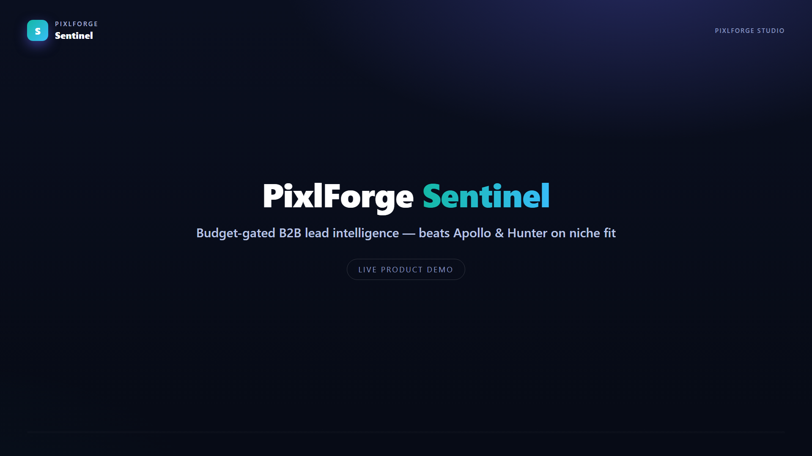
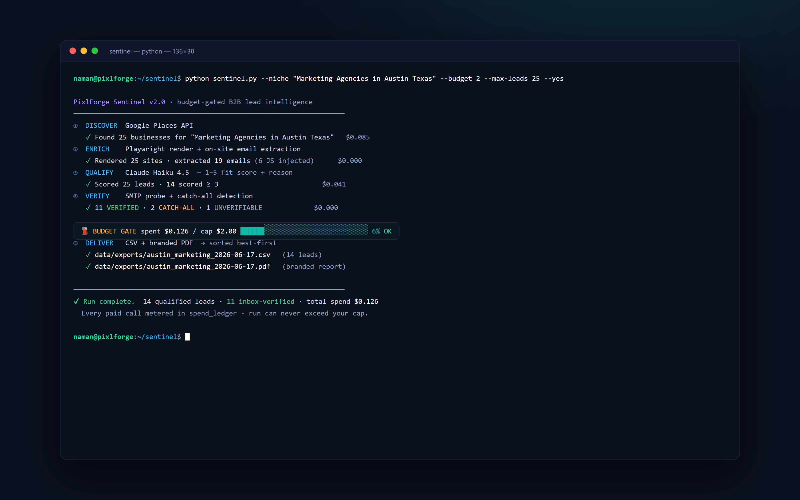
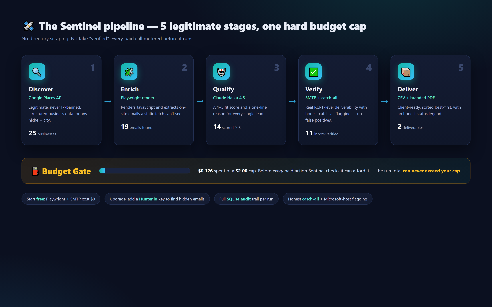
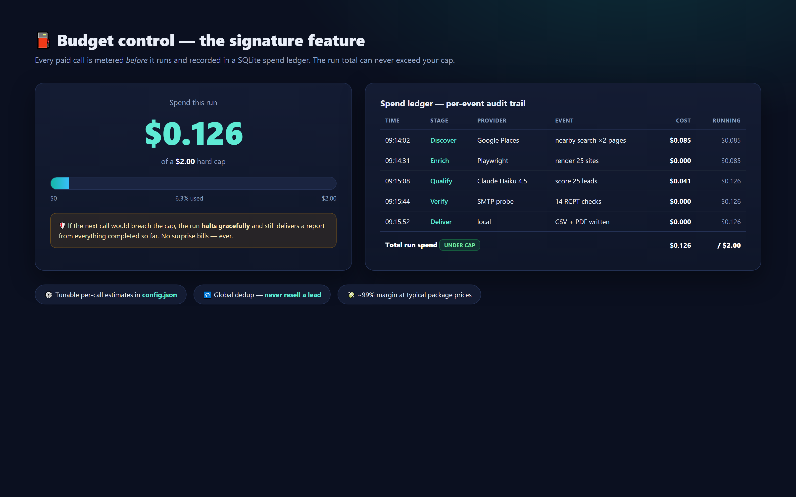
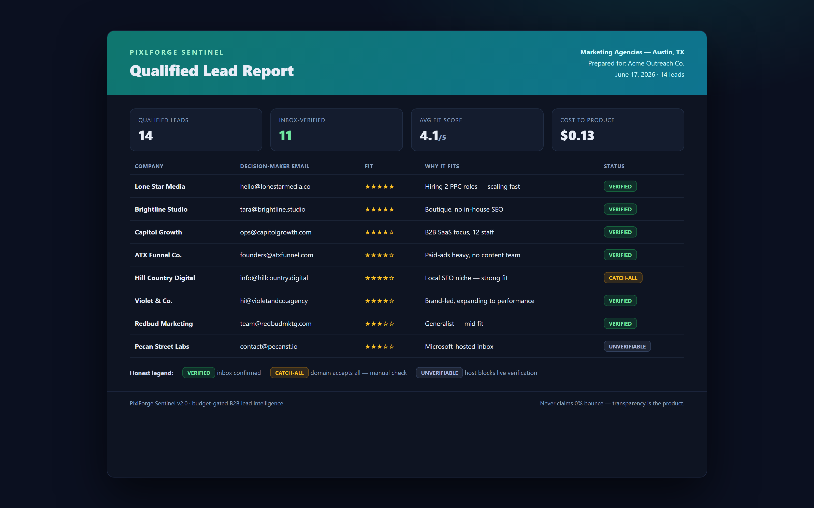

<div align="center">



# 🛰️ PixlForge Sentinel

### Budget-gated B2B lead intelligence

*You run it. You deliver a clean CSV + branded PDF. Spending can never exceed your cap.*

[](https://www.python.org/)
[](https://www.anthropic.com/)
[](https://playwright.dev/)
[](https://www.sqlite.org/)
[](#-license)

</div>

---

## 🎬 ~55-second demo

> **▶ [Watch the narrated walkthrough →](assets/sentinel-teaser.mp4)** *(AI-narrated + subtitled)*

<div align="center">

[](assets/sentinel-teaser.mp4)

</div>

<video src="https://github.com/Namanjain723/pixlforge-sentinel/raw/main/assets/sentinel-teaser.mp4" controls width="100%"></video>

---

## 💡 Why it exists

Apollo, Hunter and ZoomInfo are great at scale — and terrible at **niche** targeting and **honest** verification. The naive DIY approach is worse: directory scraping (Yelp / YellowPages / Google) gets you IP-banned and violates ToS, and DIY SMTP on port 25 is blocked by most ISPs so it marks everything "unverifiable".

**Sentinel keeps every good idea from that brief — budget cap, AI scoring, catch-all flagging, full audit, CSV + PDF — but swaps the fragile parts for reliable, legitimate sources.**

---

## ⚙️ How it works — 5 stages, one hard cap



| Stage | Engine (free combo default) | Why |
|---|---|---|
| **â‘  Discover** | Google Places API | Legitimate, never IP-banned, structured business data |
| **â‘¡ Enrich** | **Playwright** render + on-site email extraction | Catches emails injected by JavaScript a static fetch can't see |
| **③ Qualify** | **Claude Haiku 4.5** | A 1–5 fit score + a one-line reason per lead |
| **④ Verify** | **SMTP** probe + catch-all check | Real RCPT-level deliverability; honest catch-all detection — no false "verified" |
| **⑤ Deliver** | CSV + branded PDF | Client-ready, sorted best-first, with an honest status legend |

> **Start free, upgrade when revenue justifies it.** Out of the box Sentinel runs on a free verification + scraping stack (Playwright + SMTP) — only Claude + Google Places cost anything. Paste a **Hunter.io** key to auto-upgrade and additionally *find* decision-maker emails that aren't published anywhere.

---

## 🖥️ One command, start to finish

```bash
python sentinel.py --niche "Marketing Agencies in Austin Texas" --budget 2 --max-leads 25 --yes
```


**Three ways to run, safest → live:**

| Command | Spends money? | What it proves |
|---|---|---|
| `--dry-run` | No | The whole pipeline works (mock data) |
| `--live-test` | A few cents | Keys + billing + connectivity healthy — and the free stack (port 25 open, Playwright renders) |
| *(normal run)* | Yes (capped) | Produces a real client deliverable |

---

## ⛽ Budget control — the signature feature



Set `budget_cap_usd`. Before **every** paid action — each Claude call, each Places page, each Hunter find/verify — Sentinel checks whether it can afford it. If not, the run **halts gracefully** and still produces a report from whatever it completed. Every event is recorded in the `spend_ledger` table. **The run total can never exceed your cap.** No surprise bills — ever.

---

## 📦 The deliverable your client receives



A branded, dark-theme PDF (plus a CSV), sorted best-first, with an **honest status legend**:

- **VERIFIED** — inbox confirmed at the RCPT level
- **CATCH-ALL** — domain accepts everything; flagged for manual review
- **UNVERIFIABLE** — host (e.g. Microsoft) blocks live verification

> Sentinel never claims a 0% bounce rate. That transparency is a selling point, not a weakness.

---

## 🧱 Tech stack

**Python 3.11+** · **Playwright** (headless Chromium render) · **Anthropic SDK** (Claude Haiku 4.5) · **Google Places API** · **SMTP** RCPT verification · **SQLite** (runs, spend ledger, dedup) · **ReportLab** (branded PDF) · pluggable verifier providers (SMTP / Hunter / MX-basic).

```
sentinel.py            # CLI entry + pipeline orchestration
core/
  cost_gate.py         # unified USD budget enforcer (the signature feature)
  discovery.py         # Google Places business discovery
  scraper.py           # Playwright headless renderer (JS-injected emails)
  ai_analyzer.py       # Claude Haiku 4.5 qualification
  verifier.py          # verification dispatcher
  providers/           # pluggable verifiers (smtp, hunter, mx_basic)
  store.py             # SQLite: runs, spend_ledger, verified_leads
  reporter.py          # CSV + branded dark-theme PDF
business/              # SALES + MARKETING + LEGAL kit (pricing, gig, compliance)
```

---

## 💼 Built to be sold as a service

Sentinel ships with a full **business kit** (`business/`): pricing & packages with ~99% margins, an order-intake checklist, a client one-pager, a ready-to-publish Fiverr gig, outreach templates, and a plain-English CAN-SPAM / GDPR / CASL compliance guide.

---

## 👤 Author

**Naman Jain** — PixlForge Studio
📧 [info@pixlforgestudio.in](mailto:info@pixlforgestudio.in)
🔗 [github.com/Namanjain723](https://github.com/Namanjain723)

## 📄 License

© PixlForge Studio. All rights reserved. This public repository is a **showcase** — documentation, screenshots and the demo video only. The full source is private.

---

<div align="center"><sub>PixlForge Sentinel — qualified leads, on a budget you control.</sub></div>
